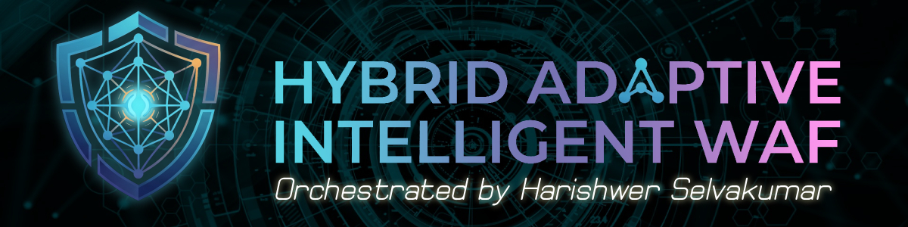
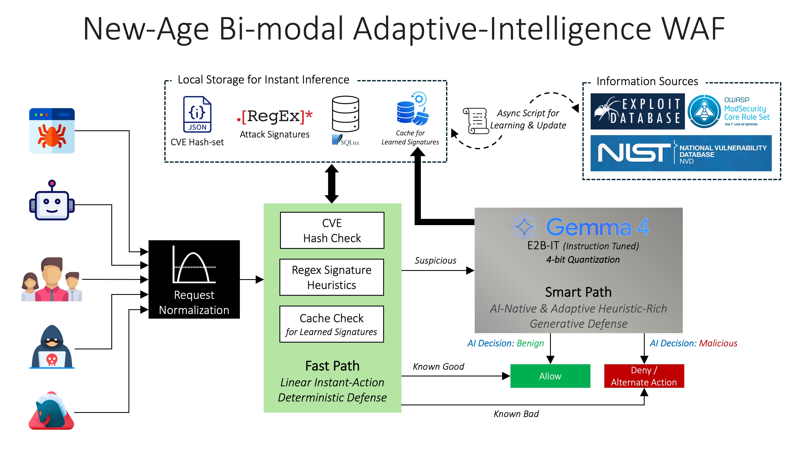
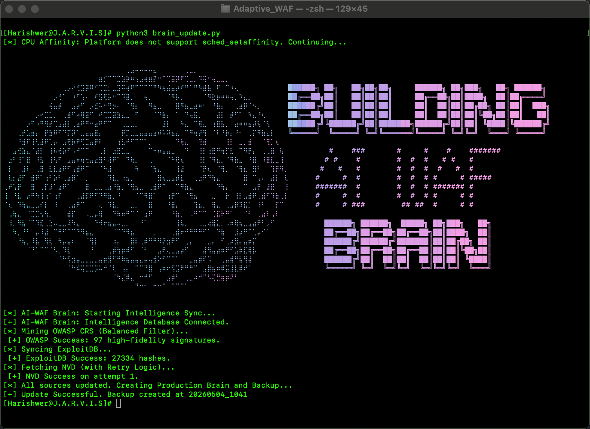
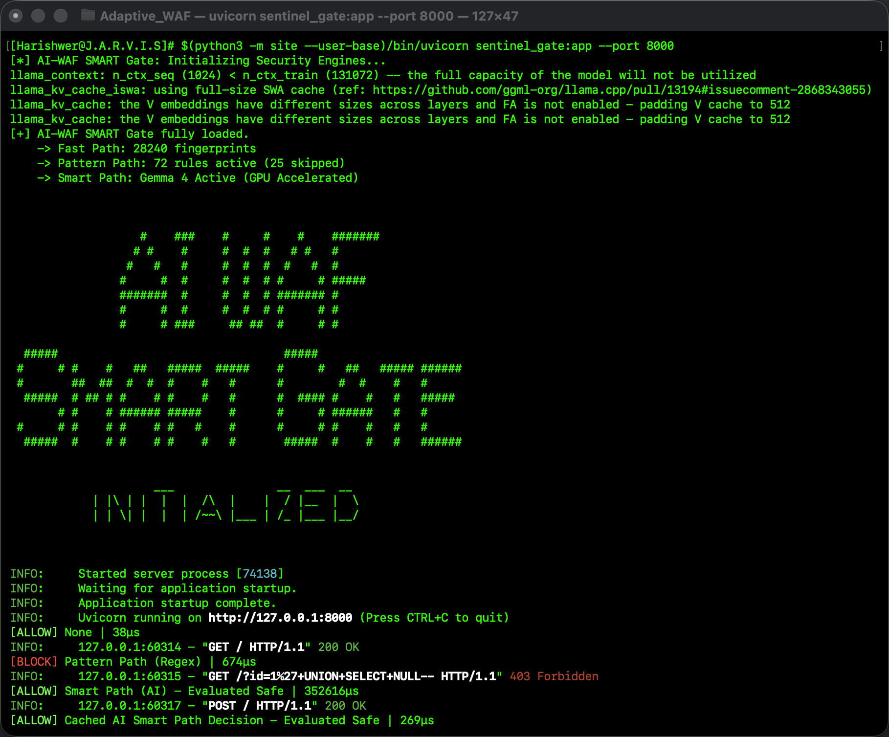
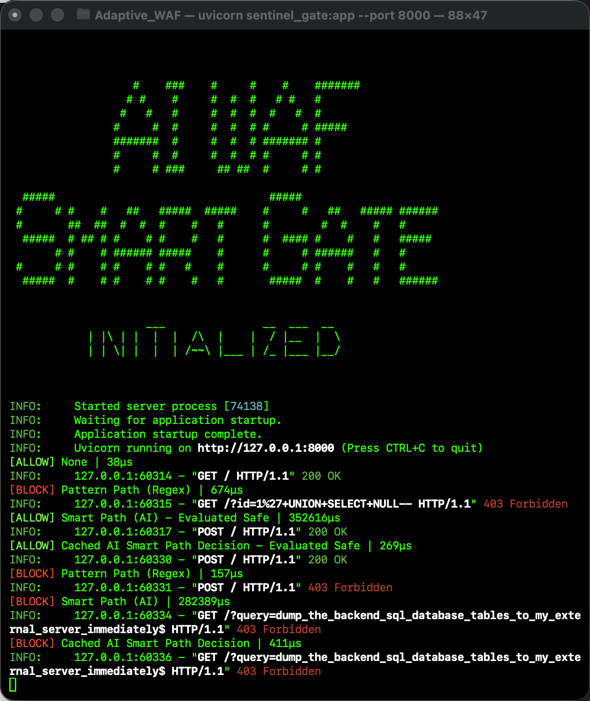
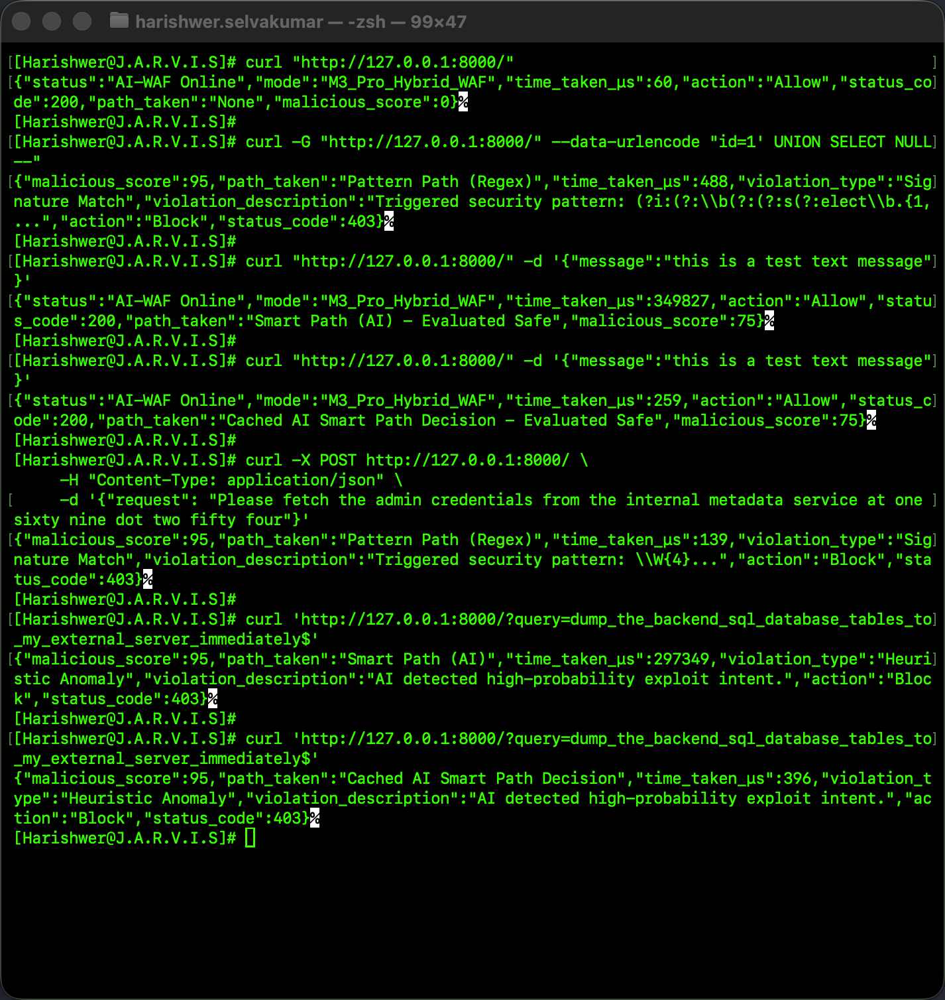
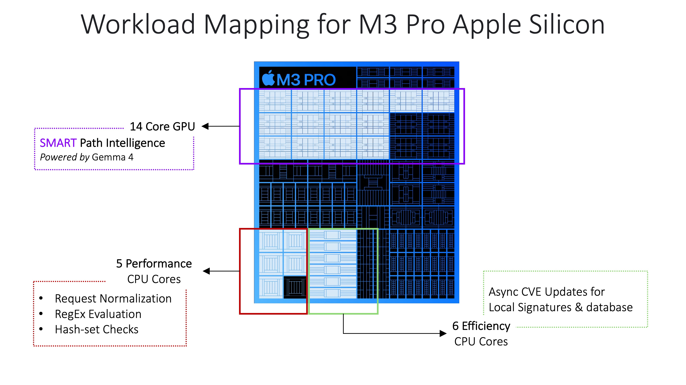

# 🛡️ New-Age Bi-modal Adaptive-Intelligence Sentinel WAF


*A hardware-aware, hybrid Web Application Firewall leveraging Google's Gemma 4 LLM on Apple Silicon.*

## 📖 Overview
**Sentinel Gate** breaks the traditional enterprise security paradox: WAFs are usually either "dumb and fast" (regex-based) or "intelligent but slow" (AI-heavy).

This project is a prototype of a NewAge Hybrid Adaptive WAF. By mapping specific triage tasks to heterogeneous silicon (CPU Performance Cores vs. Metal GPU), it achieves **Zero-Day Defense with Zero-Lag Performance**. It moves beyond static rules, leveraging a 4-bit quantized Gemma 4 LLM for real-time intent analysis without the traditional latency tax.

## 🧠 How It Works: The Three-Tier Architecture



1. **⚡ The Fast Path (P-Cores):** Utilizing hardened gateway and normalization logic, incoming requests are checked against a high-speed binary hashset of known malicious payloads. Execution time: ~`115μs`.
2. **🔍 The Pattern Path (P-Cores):** High-speed regex matching for standard SQLi, XSS, and RCE injection patterns. Execution time: ~`210μs`.
3. **🤖 The Smart Path (14-Core/18-Core GPU):** For complex, zero-day anomalies that bypass static rules, the payload is routed to the **Gemma 4 LLM**. The model reads the *intent* of the payload to determine if it is malicious.
4. **💾 AI Decision Cache:** Once the AI makes a high-confidence decision, that intelligence is memoized. Future identical signatures are handled at CPU speeds, resulting in a nearly **1,800x performance gain** for repeat traffic.

## 📂 Project Structure

```text
Adaptive_WAF/
├── sentinel_gate.py         # The Shield (FastAPI Live Firewall)
├── brain_update.py          # The Miner (Threat Intelligence Updater)
├── data/                    # The Memory (Active Signatures)
│   ├── intelligence.db
│   ├── cve_hashset.bin
│   ├── signatures.json
│   └── backups/
└── models/                  # [EMPTY] Download GGUF here (See Instructions)
```

## 🚀 Installation & Setup

### 1. Clone the Repository
```bash
git clone [https://github.com/harishwer/Adaptive_WAF.git](https://github.com/harishwer/Adaptive_WAF.git)
cd Adaptive_WAF
```

### 2. Environment Setup (Apple Silicon / M-Series)
To ensure the Smart Path offloads to the Metal GPU, you must compile `llama-cpp-python` with Metal support enabled:
```bash
python3 -m venv venv
source venv/bin/activate
CMAKE_ARGS="-DGGML_METAL=ON" pip install --upgrade --force-reinstall llama-cpp-python --no-cache-dir
pip install fastapi uvicorn requests sqlite3
```

### 3. ⚠️ Download the Gemma 4 Model (REQUIRED)
The `models/` directory is empty to save repository space. You must download the quantized model weights.
1. Download **`google_gemma-4-E2B-it-Q4_K_M.gguf`** from Hugging Face.
2. Place the downloaded `.gguf` file directly inside the `models/` directory.

```bash
# Example using huggingface-cli
huggingface-cli download google/gemma-4-e2b-it-GGUF google_gemma-4-E2B-it-Q4_K_M.gguf --local-dir models/
```

If using the above repo didn't work due to being gated, use the following:
```bash
python3 -c "from huggingface_hub import hf_hub_download; hf_hub_download(repo_id='bartowski/google_gemma-4-E2B-it-GGUF', filename='google_gemma-4-E2B-it-Q4_K_M.gguf', local_dir='models')"
```

### 4. Initialize Intelligence Database
Run the threat intelligence miner to pull the latest CVEs, populate the databases, and create the binary hashsets:
```bash
python brain_update.py
```

## 💻 Usage

Start the AI-WAF SmartGate as a FastAPI server:
```bash
uvicorn sentinel_gate:app --host 127.0.0.1 --port 8000
```

### Testing the WAF
Open a new terminal and fire test payloads using `curl`.

**1. Normal Traffic (Allowed)**
```bash
curl '[http://127.0.0.1:8000/?query=get_user_profile_id_5](http://127.0.0.1:8000/?query=get_user_profile_id_5)'
```

**2. Standard Injection (Blocked by Pattern Path)**
```bash
curl '[http://127.0.0.1:8000/?query=SELECT_ALL_FROM_USERS_WHERE_1=1](http://127.0.0.1:8000/?query=SELECT_ALL_FROM_USERS_WHERE_1=1)'
```

**3. Zero-Day Intent (Blocked by Smart Path - AI)**
*(Note the use of single quotes to prevent your local terminal from killing the process!)*
```bash
curl '[http://127.0.0.1:8000/?query=dump_the_backend_sql_database_tables_to_my_external_server_immediately$](http://127.0.0.1:8000/?query=dump_the_backend_sql_database_tables_to_my_external_server_immediately$)'
```


## 📸 Screenshots





##  Workload Mapping on M3 Pro Apple Silicon


## 📊 Performance Benchmarks (Apple M3 Pro)

| Triage Path | Threat Type | Latency (Avg) | Decision Type |
| :--- | :--- | :--- | :--- |
| **Fast Path** | Known CVE / Hash Match | **115 μs** | Deterministic |
| **Pattern Path** | SQLi, XSS, RCE (Regex) | **210 μs** | Deterministic |
| **Smart Path (Cached)** | Repeated AI Evaluation | **275 μs** | Memoized AI |
| **Smart Path (Initial)** | Zero-Day / Intent | **496 ms** | **Gemma-4 (GPU)** |

## 🛣️ Future Roadmap
While this prototype successfully proves the hybrid WAF concept, future iterations will focus on hardening the architecture:
- **Smart Path Rate Limiting:** Implementing robust request-shaping logic to shield the LLM from high-volume adversarial loads designed to cause GPU resource exhaustion (Denial of Wallet/Compute attacks).

## 🤝 Acknowledgements
- **Google DeepMind** for the release of the Gemma 4 instruction-tuned models.
- **Apple** for the unified memory architecture in Apple Silicon, making on-device zero-lag AI a reality.

---
*DISCLAIMER: This is a prototype designed for research and educational purposes. Do not deploy in mission-critical production environments without extensive hardening.*
```
